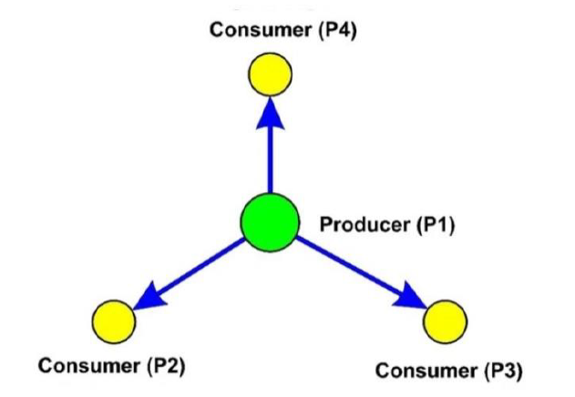

# Local-stability-analysis-of-the-4-node-star-system-using-machine-learning

## Introduction

The Smart Grid is an evolution of electricity grids that have been distributing power from a few generators or power plants to a large number of users since the 20th century. The innovation allows electricity to travel from multiple nodes making the grid capable of responding in a timely manner to the demand for more or less consumption of one or more users, it also ensures easier integration of renewable energy into electricity distribution networks, which will soon dominate power generation. This approach is able to balance supply and demand, ensuring dynamic and cost-effective grid operation.
In this project, the impact of a given grid topology (shown in the figure below) is analyzed by evaluating its stability, an important quality factor. This is a supervised regression problem, and the aim is to predict, from a specific input, the maximum real part of the solution of the system characteristic equation. A negative value of the latter will imply stability of the system, while with a positive value the system will be linearly unstable.

## Dataset Description

The dataset (https://archive.ics.uci.edu/ml/datasets/Electrical+Grid+Stability+Simulated+Data+) contains 10000 records and 12 features. The compact description of them is given in the table below:

| Feature                                     | Description                                          |
|---------------------------------------------|------------------------------------------------------|
| tau[x] x = 1, 2, 3, 4                       | Reaction time of participant                         |
| p[x] x = 1, 2, 3, 4 p1 = abs(p2 + p3 + p4 ) | Nominal power consumed                               |
| g[x] x = 1, 2, 3, 4                         | Coefficient (gamma) proportional to price elasticity |

## Models

Three different predictive models, compatible with the regression problem at hand and configured with the best hyperparameters, were used and compared with each other:

- LASSO: The coefficients θ of the regression model are constrained to take values close to or even equal to 0. The latter
circumstance occurs in the presence of a high regularization parameter λ.
- RIDGE: Similar to LASSO, the only difference lies in the fact that the θ coefficients never assume a value of 0.
- MULTILAYER PERCEPTRON (MLP): Artificial neural network whose performance varies according to the number of hidden layers, number of nodes in each hidden layer and the activation functions of each hidden layer.